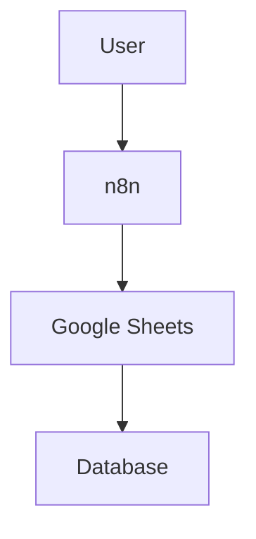
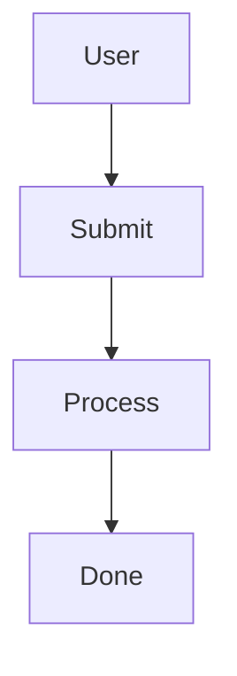

# PRD — Markdown to PDF Web Application

**Version:** 1.0
**Date:** 7 September 2026
**Product Type:** Web Application
**Primary Goal:** Membuat aplikasi web untuk menulis, mem-preview, dan mengonversi Markdown menjadi PDF berkualitas tinggi, dengan dukungan Mermaid Diagram, KaTeX/LaTeX, syntax highlighting, table, image, dan custom styling.

---

# 1. Product Overview

## 1.1 Nama Produk

Untuk sementara:

**Markdown2PDF**

Nama dan branding dapat diganti kemudian.

---

## 1.2 Product Vision

Membangun aplikasi web yang memungkinkan pengguna:

1. Menulis Markdown.
2. Melihat hasil rendering secara real-time.
3. Menggunakan Mermaid untuk diagram.
4. Menggunakan LaTeX/KaTeX untuk formula matematika.
5. Menggunakan syntax highlighting untuk code block.
6. Menambahkan gambar.
7. Mengatur format dokumen.
8. Menghasilkan PDF dengan kualitas profesional.
9. Mengunduh PDF secara langsung.

Aplikasi harus terasa seperti kombinasi:

```text
Markdown Editor
       +
Live Preview
       +
Document Renderer
       +
PDF Generator
```

---

# 2. Problem Statement

Markdown sangat nyaman digunakan untuk menulis dokumentasi, laporan teknis, SOP, workflow, dokumentasi software, dan technical report.

Namun, ketika Markdown perlu dijadikan PDF, pengguna biasanya harus menggunakan beberapa tools berbeda.

Contoh workflow yang tidak ideal:

```text
Write Markdown
      ↓
Find Markdown Converter
      ↓
Fix Mermaid
      ↓
Fix Math
      ↓
Fix CSS
      ↓
Fix Page Break
      ↓
Generate PDF
      ↓
Check PDF
      ↓
Repeat
```

Produk ini harus menyederhanakan menjadi:

```text
Write Markdown
      ↓
Live Preview
      ↓
Export PDF
```

---

# 3. Target Users

## 3.1 Primary Users

### Developer

Untuk:

* README
* technical documentation
* API documentation
* architecture documentation
* system design
* flowchart

### Engineer

Untuk:

* engineering report
* machine documentation
* wiring documentation
* workflow
* system architecture

### Student

Untuk:

* laporan
* tugas
* dokumentasi project
* thesis notes

### Technical Writer

Untuk:

* SOP
* technical manual
* documentation
* internal reports

---

# 4. Core Features

MVP wajib memiliki:

### Editor

* Markdown editor
* Syntax highlighting
* Line numbers
* Keyboard shortcuts
* Auto indentation
* Tab handling
* Find/replace

### Preview

* Real-time rendering
* Markdown
* GFM
* Tables
* Code blocks
* Images
* Mermaid
* KaTeX

### PDF

* A4
* Letter
* Custom page size
* Portrait
* Landscape
* Margins
* Header
* Footer
* Page numbering
* Custom CSS
* Page breaks

### File

* New document
* Open Markdown
* Import `.md`
* Export `.md`
* Export PDF

---

# 5. Supported Markdown

Gunakan **GitHub Flavored Markdown (GFM)**.

Wajib mendukung:

```markdown
# Heading

## Heading 2

**Bold**

*Italic*

~~Strikethrough~~

- List
- List

1. Ordered
2. List

> Blockquote

[Link](https://example.com)


```

---

# 6. Tables

Contoh:

```markdown
| Component | Protocol | Status |
|---|---|---|
| PLC | Modbus RTU | Active |
| Sensor | 4-20mA | Active |
| ESP32 | MQTT | Active |
```

Harus menghasilkan tabel HTML yang proper.

Tabel harus:

* responsive di preview
* memiliki border
* memiliki header
* dapat masuk PDF
* tidak terpotong secara horizontal jika memungkinkan

---

# 7. Code Block

Contoh:

````markdown
```python
def hello():
    print("Hello World")
```
````

Harus menghasilkan syntax highlighting.

Minimal bahasa:

```text
JavaScript
TypeScript
Python
C
C++
Java
Kotlin
HTML
CSS
JSON
YAML
Bash
SQL
Arduino
Markdown
XML
```

Gunakan **Shiki** sebagai preferred syntax highlighting engine.

---

# 8. Mermaid Support

Ini adalah fitur penting.

Input:

````markdown

````

Preview harus menampilkan:

```text
┌──────┐
│ User │
└──┬───┘
   ↓
┌─────┐
│ n8n │
└──┬──┘
   ↓
Google Sheets
```

Bukan menampilkan raw Markdown.

---

# 9. Mermaid Rendering Architecture

Mermaid harus diproses secara khusus.

Pipeline:

```text
Markdown
   ↓
Markdown Parser
   ↓
Detect Mermaid Code Block
   ↓
Mermaid Renderer
   ↓
SVG
   ↓
HTML
   ↓
PDF
```

Jangan mengandalkan Markdown parser saja untuk Mermaid.

---

# 10. Mermaid Error Handling

Jika Mermaid invalid:

````text
```mermaid
flowchart TD
    A -->>
````

````

Jangan membuat seluruh document gagal.

Tampilkan:

```text
┌───────────────────────────────┐
│ Mermaid rendering error       │
│                               │
│ Unexpected token ...          │
│                               │
│ Check your Mermaid syntax.    │
└───────────────────────────────┘
````

Dokumen lainnya tetap dirender.

---

# 11. KaTeX / Mathematical Formula

Wajib mendukung inline math:

```markdown
Einstein equation: $E = mc^2$
```

dan block math:

```markdown
$$
E = mc^2
$$
```

Contoh:

```latex
$$
\int_0^1 x^2 dx = \frac{1}{3}
$$
```

Gunakan:

**KaTeX**

Pipeline:

```text
Markdown
 ↓
Math Detection
 ↓
KaTeX
 ↓
HTML
```

---

# 12. Images

Markdown:

```markdown

```

Support:

* local image
* uploaded image
* remote image URL

Preview harus menampilkan image.

PDF harus memasukkan image.

Image harus memiliki:

```css
max-width: 100%;
height: auto;
```

Jangan sampai gambar keluar dari halaman PDF.

---

# 13. Drag & Drop Image

User dapat:

```text
Drag Image
     ↓
Editor
     ↓

```

Jika memungkinkan, aplikasi otomatis memasukkan:

```markdown

```

---

# 14. Editor Layout

Desktop layout:

```text
┌────────────────────────────────────────────────────────────┐
│ Markdown2PDF                            New  Open  Export  │
├───────────────────────┬────────────────────────────────────┤
│                       │                                    │
│                       │                                    │
│       EDITOR          │             PREVIEW                │
│                       │                                    │
│                       │                                    │
│                       │                                    │
│                       │                                    │
│                       │                                    │
│                       │                                    │
└───────────────────────┴────────────────────────────────────┘
```

Default:

```text
Editor : 50%
Preview: 50%
```

User dapat melakukan resize divider.

---

# 15. Responsive Design

Desktop:

```text
Editor | Preview
```

Tablet:

```text
Editor
Preview
```

Mobile:

gunakan tab:

```text
[ EDITOR ] [ PREVIEW ]
```

---

# 16. Toolbar

Toolbar minimal:

```text
Undo
Redo
Bold
Italic
Strike
Heading
Link
Image
Code
Code Block
Quote
Bullet List
Numbered List
Table
Mermaid
Math
Horizontal Rule
```

Toolbar hanya membantu memasukkan Markdown.

Contoh klik **Bold**:

```text
Hello world
```

menjadi:

```text
**Hello world**
```

---

# 17. Keyboard Shortcuts

Minimal:

```text
Ctrl + B       Bold
Ctrl + I       Italic
Ctrl + K       Link
Ctrl + S       Save
Ctrl + Z       Undo
Ctrl + Shift + Z Redo
Ctrl + F       Find
```

---

# 18. Document Settings

Tambahkan panel:

```text
Document Settings
```

Options:

### Page Size

```text
A4
A5
Letter
Legal
Custom
```

Default:

```text
A4
```

### Orientation

```text
Portrait
Landscape
```

Default:

```text
Portrait
```

### Margins

```text
Top
Right
Bottom
Left
```

Default:

```text
20mm
```

---

# 19. PDF Styling

PDF harus menggunakan CSS yang terpisah dari UI.

Contoh:

```text
application
│
├── UI CSS
│
└── document CSS
```

Document CSS bertanggung jawab terhadap:

* typography
* heading
* paragraph
* table
* code
* image
* Mermaid
* KaTeX
* page break

---

# 20. PDF Generation

Recommended architecture:

```text
Markdown
   ↓
HTML
   ↓
Rendered HTML
   ↓
CSS
   ↓
Chromium
   ↓
PDF
```

Gunakan:

**Puppeteer + Chromium**

Backend harus melakukan:

```javascript
page.setContent(html)
page.pdf(...)
```

---

# 21. PDF Quality Requirements

PDF harus:

* selectable text
* searchable text
* vector Mermaid diagram
* high-quality mathematical formula
* proper font rendering
* proper page breaks
* proper table rendering

Hindari screenshot seluruh preview menjadi PDF.

---

# 22. Page Break

Support:

```html
<div class="page-break"></div>
```

atau custom Markdown syntax.

CSS:

```css
.page-break {
    break-before: page;
}
```

---

# 23. Avoid Page Break Problems

Heading tidak boleh sendirian di bagian bawah halaman.

Gunakan:

```css
h1,
h2,
h3 {
    break-after: avoid;
}
```

Table row sebisa mungkin tidak terpotong.

Code block juga sebisa mungkin tidak dipotong secara buruk.

---

# 24. Header & Footer

User dapat mengaktifkan:

```text
☑ Header
☑ Footer
☑ Page Number
```

Contoh:

```text
Company Technical Documentation
────────────────────────────────────

              CONTENT

────────────────────────────────────
Page 1
```

---

# 25. Custom CSS

Advanced users dapat memasukkan CSS:

```css
body {
    font-family: Arial;
}

h1 {
    font-size: 28px;
}

table {
    border-collapse: collapse;
}
```

CSS tersebut hanya diterapkan ke document rendering.

**Jangan memberikan akses CSS tersebut ke UI aplikasi.**

---

# 26. Theme

Minimal:

```text
Light
Dark
```

Theme editor/preview dapat berbeda dengan PDF.

PDF default tetap:

```text
Light
```

---

# 27. File Management

MVP:

```text
New
Open
Save
Download
```

Supported:

```text
.md
.markdown
.txt
```

Export:

```text
.md
.pdf
```

---

# 28. Auto Save

Editor harus menyimpan draft secara otomatis ke browser.

Gunakan:

```text
localStorage
```

atau:

```text
IndexedDB
```

Recommended:

**IndexedDB**

karena document dapat berukuran lebih besar.

Auto-save interval:

```text
500–1000 ms debounce
```

---

# 29. Unsaved Changes

Jika user memiliki perubahan:

```text
Document modified
```

Saat keluar:

```text
Are you sure you want to leave?

Changes have not been saved.
```

---

# 30. Backend Architecture

Recommended:

```text
Next.js
```

dengan:

```text
Frontend
React
TypeScript

Backend
Next.js API Routes / Route Handlers

PDF
Puppeteer
Chromium
```

Architecture:

```text
Browser
   │
   │ Markdown
   ↓
Next.js
   │
   ├── Markdown Renderer
   ├── Mermaid
   ├── KaTeX
   ├── Shiki
   │
   ↓
HTML
   │
   ↓
Puppeteer
   │
   ↓
Chromium
   │
   ↓
PDF
```

---

# 31. Recommended Technology Stack

## Frontend

```text
Next.js
React
TypeScript
Tailwind CSS
```

## Markdown

```text
unified
remark
remark-parse
remark-gfm
remark-rehype
rehype
```

## Mermaid

```text
mermaid
```

## Mathematics

```text
katex
remark-math
rehype-katex
```

## Syntax Highlighting

Preferred:

```text
shiki
```

## PDF

```text
puppeteer
chromium
```

## Editor

Preferred:

```text
CodeMirror 6
```

Alternative:

```text
Monaco Editor
```

Untuk aplikasi ringan, **CodeMirror 6 lebih disarankan**.

---

# 32. Recommended Project Structure

Agent harus membuat struktur seperti:

```text
markdown2pdf/
│
├── app/
│   ├── page.tsx
│   ├── layout.tsx
│   │
│   ├── api/
│   │   └── pdf/
│   │       └── route.ts
│   │
│   └── globals.css
│
├── components/
│   ├── editor/
│   │   ├── MarkdownEditor.tsx
│   │   ├── EditorToolbar.tsx
│   │   └── EditorTabs.tsx
│   │
│   ├── preview/
│   │   ├── MarkdownPreview.tsx
│   │   ├── MermaidRenderer.tsx
│   │   └── MathRenderer.tsx
│   │
│   ├── pdf/
│   │   ├── PdfSettings.tsx
│   │   └── ExportPdfButton.tsx
│   │
│   └── layout/
│       ├── Header.tsx
│       ├── Sidebar.tsx
│       └── ResizablePanel.tsx
│
├── lib/
│   ├── markdown/
│   │   ├── parser.ts
│   │   ├── plugins.ts
│   │   └── renderer.ts
│   │
│   ├── mermaid/
│   │   └── renderer.ts
│   │
│   ├── pdf/
│   │   ├── generator.ts
│   │   └── template.ts
│   │
│   └── storage/
│       └── documentStore.ts
│
├── styles/
│   ├── editor.css
│   ├── preview.css
│   └── print.css
│
├── public/
│   └── ...
│
├── package.json
├── tsconfig.json
└── README.md
```

---

# 33. Rendering Pipeline

Ini bagian yang **wajib diikuti agent**.

```text
                     MARKDOWN
                         │
                         ▼
                ┌─────────────────┐
                │ Markdown Parser  │
                │ remark + GFM     │
                └────────┬────────┘
                         │
                         ▼
                     AST / HTML
                         │
          ┌──────────────┼──────────────┐
          │              │              │
          ▼              ▼              ▼
      Mermaid          KaTeX          Code
      Renderer        Renderer      Highlight
          │              │              │
          └──────────────┼──────────────┘
                         ▼
                   Rendered HTML
                         │
                         ▼
                    CSS Styling
                         │
                         ▼
                    PDF Template
                         │
                         ▼
                      Puppeteer
                         │
                         ▼
                     Chromium
                         │
                         ▼
                        PDF
```

---

# 34. Security Requirements

Ini penting karena user dapat memasukkan HTML/Markdown.

Jangan langsung melakukan:

```javascript
dangerouslySetInnerHTML
```

tanpa sanitization.

Gunakan:

```text
rehype-sanitize
```

atau mekanisme sanitization equivalent.

Harus mencegah:

* XSS
* malicious HTML
* JavaScript injection
* dangerous URLs
* arbitrary script execution

---

# 35. PDF API

Endpoint:

```text
POST /api/pdf
```

Request:

```json
{
  "markdown": "# Hello World",
  "settings": {
    "format": "A4",
    "orientation": "portrait",
    "margin": {
      "top": "20mm",
      "right": "20mm",
      "bottom": "20mm",
      "left": "20mm"
    }
  }
}
```

Response:

```text
application/pdf
```

---

# 36. API Validation

Backend harus melakukan validation.

Contoh:

```text
markdown
required
string
max size

settings
optional
object

format
A4 | A5 | Letter | Legal

orientation
portrait | landscape
```

Jangan percaya input client.

---

# 37. Performance Requirements

Target:

### Preview

Markdown sederhana:

```text
< 100 ms
```

Markdown kompleks:

```text
< 500 ms
```

PDF:

```text
< 5 seconds
```

untuk dokumen normal.

---

# 38. Large Document

Aplikasi harus tetap dapat menangani minimal:

```text
10,000 lines Markdown
```

tanpa browser freeze.

Editor harus menggunakan virtualization bila diperlukan.

---

# 39. Mermaid Performance

Jangan render ulang semua Mermaid diagram setiap kali user mengetik satu karakter.

Gunakan:

```text
debounce
```

dan caching.

Contoh:

```text
User typing
     ↓
300ms debounce
     ↓
Render changed diagram
```

---

# 40. Error Handling

Error harus ditampilkan secara lokal.

Misalnya KaTeX error:

```text
Math rendering error
```

Mermaid error:

```text
Diagram rendering error
```

Image error:

```text
Unable to load image
```

PDF error:

```text
PDF generation failed.
Please try again.
```

Jangan menampilkan stack trace kepada user.

Stack trace hanya untuk development/logging.

---

# 41. Accessibility

Minimal:

* keyboard navigation
* accessible buttons
* tooltip
* ARIA labels
* sufficient contrast
* focus state

---

# 42. Browser Support

Target:

```text
Chrome
Edge
Firefox
Safari
```

Desktop-first.

Mobile tetap usable.

---

# 43. SEO

Landing page harus memiliki:

```text
Title
Description
OpenGraph metadata
Twitter metadata
Canonical URL
```

---

# 44. Landing Page

Jika aplikasi memiliki landing page:

```text
┌──────────────────────────────────────────┐
│ Markdown2PDF                             │
│                                          │
│ Convert Markdown to beautiful PDF        │
│                                          │
│ [Start Writing]                          │
│                                          │
│ Markdown  Mermaid  KaTeX  PDF            │
└──────────────────────────────────────────┘
```

Features:

```text
✓ Markdown
✓ Mermaid
✓ Math
✓ Code Highlighting
✓ Custom PDF
✓ A4 / Letter
✓ Live Preview
```

---

# 45. Main Application UX

Header:

```text
┌─────────────────────────────────────────────────────────────┐
│ Markdown2PDF │ Untitled.md │ Save │ Export PDF │ Settings  │
└─────────────────────────────────────────────────────────────┘
```

Toolbar:

```text
┌─────────────────────────────────────────────────────────────┐
│ B I S H1 H2 Link Image Code Quote List Table Mermaid Math │
└─────────────────────────────────────────────────────────────┘
```

Content:

````text
┌─────────────────────────────┬───────────────────────────────┐
│                             │                               │
│ Markdown Editor             │ PDF Preview                   │
│                             │                               │
│ # My Document               │ My Document                   │
│                             │                               │
│ ## Architecture             │ Architecture                 │
│                             │                               │
│ ```mermaid                  │       ┌─────┐                 │
│ flowchart TD                │       │ API │                 │
│ A --> B                     │       └──┬──┘                 │
│ ```                         │          ↓                    │
│                             │        DB                     │
│                             │                               │
└─────────────────────────────┴───────────────────────────────┘
````

---

# 46. PDF Preview

Preview harus sedekat mungkin dengan hasil PDF.

Jangan membuat:

```text
Preview Renderer A
PDF Renderer B
```

yang menghasilkan tampilan berbeda.

Gunakan shared document rendering pipeline:

```text
Markdown
   ↓
Document HTML
   ↓
       ┌───────────┐
       ↓           ↓
   Web Preview   PDF
                 ↓
             Chromium
```

Dengan demikian:

```text
Preview ≈ PDF
```

---

# 47. Critical Requirement — Mermaid

Acceptance criteria:

Input:

````markdown

````

Expected:

### Preview

Mermaid diagram muncul sebagai SVG.

### PDF

Diagram muncul sebagai vector graphic / SVG-rendered content.

### Tidak boleh

````text
```mermaid
flowchart TD
...
````

````

muncul sebagai teks biasa.

---

# 48. Critical Requirement — KaTeX

Input:

```markdown
The formula is:

$$
E = mc^2
$$
````

Expected:

Formula ter-render.

Tidak boleh:

```text
$$ E = mc^2 $$
```

muncul sebagai plain text.

---

# 49. Critical Requirement — Code

Input:

````markdown
```python
print("Hello")
```
````

Expected:

Syntax highlighting.

---

# 50. Critical Requirement — PDF

PDF harus:

```text
Selectable
Searchable
Printable
High quality
```

Text tidak boleh menjadi screenshot.

---

# 51. Testing Requirements

Agent wajib membuat test untuk:

### Markdown

```text
heading
bold
italic
lists
links
tables
blockquote
code
images
```

### Mermaid

```text
flowchart
sequenceDiagram
classDiagram
stateDiagram
erDiagram
```

### Math

```text
inline
block
fraction
integral
matrix
```

### PDF

```text
A4
Letter
portrait
landscape
margin
header
footer
page number
```

---

# 52. End-to-End Test

Minimal test:

```text
Open application
       ↓
Type Markdown
       ↓
Add Mermaid
       ↓
Add KaTeX
       ↓
Add code block
       ↓
Preview
       ↓
Export PDF
       ↓
Open PDF
       ↓
Verify rendering
```

---

# 53. Definition of Done

MVP dianggap selesai jika:

* [ ] Markdown editor bekerja
* [ ] Live preview bekerja
* [ ] GFM bekerja
* [ ] Tables bekerja
* [ ] Code highlighting bekerja
* [ ] Mermaid bekerja
* [ ] KaTeX bekerja
* [ ] Image bekerja
* [ ] PDF export bekerja
* [ ] A4 bekerja
* [ ] Letter bekerja
* [ ] Portrait bekerja
* [ ] Landscape bekerja
* [ ] Margin bekerja
* [ ] Page break bekerja
* [ ] Header/footer bekerja
* [ ] Page number bekerja
* [ ] Custom CSS bekerja
* [ ] Auto-save bekerja
* [ ] Error handling bekerja
* [ ] XSS protection tersedia
* [ ] Responsive layout bekerja
* [ ] E2E test tersedia

---

# 54. Development Phases

Agent **jangan langsung membangun seluruh fitur sekaligus**.

Gunakan fase:

### Phase 1 — Foundation

```text
Next.js
TypeScript
Tailwind
CodeMirror
Basic layout
```

### Phase 2 — Markdown

```text
remark
GFM
HTML rendering
Preview
```

### Phase 3 — Advanced Rendering

```text
Mermaid
KaTeX
Shiki
Images
```

### Phase 4 — PDF

```text
Puppeteer
Chromium
PDF CSS
A4
Letter
Page break
```

### Phase 5 — Editor UX

```text
Toolbar
Shortcuts
Auto save
File import/export
```

### Phase 6 — Advanced PDF

```text
Header
Footer
Page number
Custom CSS
```

### Phase 7 — Security & Testing

```text
Sanitization
Validation
Unit tests
E2E tests
Performance testing
```

### Phase 8 — Production

```text
Docker
Environment variables
Logging
Error handling
Production build
```

---

# 55. Important Instructions for AI Agent

Tambahkan instruksi ini **di bagian paling bawah PRD** ketika kamu memberikannya ke agent:

> **Implementation Rules**
>
> 1. Jangan membuat mock implementation untuk fitur utama.
> 2. Mermaid harus benar-benar dirender menggunakan Mermaid renderer.
> 3. KaTeX harus benar-benar merender mathematical expressions.
> 4. PDF harus dibuat menggunakan Chromium/Puppeteer atau equivalent browser-based renderer.
> 5. Jangan menggunakan screenshot dari preview sebagai PDF.
> 6. Preview dan PDF harus menggunakan rendering pipeline yang sama sebanyak mungkin.
> 7. Jangan meng-hardcode hasil Mermaid.
> 8. Jangan menghapus fitur yang disebutkan dalam PRD tanpa alasan teknis.
> 9. Jika library tertentu memiliki incompatibility, pilih library alternatif yang memiliki fungsi equivalent dan dokumentasikan alasannya.
> 10. Semua dependency harus dicatat di `package.json`.
> 11. Semua environment variable harus dicatat dalam `.env.example`.
> 12. Buat README yang menjelaskan instalasi dan deployment.
> 13. Jangan memasukkan API key atau secret ke source code.
> 14. Semua input user harus divalidasi dan disanitasi.
> 15. Prioritaskan correctness dan rendering quality dibandingkan menambahkan fitur tambahan.
> 16. Setelah setiap phase selesai, jalankan test sebelum melanjutkan phase berikutnya.
> 17. Jangan menganggap fitur selesai hanya karena UI sudah dibuat; setiap fitur harus benar-benar berfungsi end-to-end.

---

## 56. Prioritas Fitur

Agent harus mengikuti prioritas:

| Priority | Feature            |
| -------- | ------------------ |
| 🔴 P0    | Markdown Editor    |
| 🔴 P0    | Live Preview       |
| 🔴 P0    | Markdown Rendering |
| 🔴 P0    | Mermaid            |
| 🔴 P0    | KaTeX              |
| 🔴 P0    | Code Highlighting  |
| 🔴 P0    | PDF Export         |
| 🔴 P0    | A4 PDF             |
| 🟠 P1    | Image              |
| 🟠 P1    | Tables             |
| 🟠 P1    | Page Settings      |
| 🟠 P1    | Page Break         |
| 🟠 P1    | Header/Footer      |
| 🟠 P1    | Auto Save          |
| 🟡 P2    | Custom CSS         |
| 🟡 P2    | Multiple Documents |
| 🟡 P2    | Cloud Storage      |
| 🟡 P2    | Authentication     |
| 🟢 P3    | Collaboration      |
| 🟢 P3    | AI Writing         |
| 🟢 P3    | Templates          |

---

# 57. MVP Scope

Untuk **versi pertama**, jangan membuat:

```text
Authentication
Payment
Subscription
Team collaboration
Cloud storage
AI writing
```

Fokus:

```text
                ┌──────────────┐
                │   Markdown   │
                │    Editor    │
                └──────┬───────┘
                       ↓
              ┌─────────────────┐
              │ Markdown Engine │
              └───────┬─────────┘
                      ↓
        ┌─────────────┼─────────────┐
        ↓             ↓             ↓
    Mermaid         KaTeX        Shiki
        │             │             │
        └─────────────┼─────────────┘
                      ↓
                 HTML + CSS
                      ↓
                 Chromium
                      ↓
                     PDF
```

**Itu adalah core product.**

---

## 58. Target Akhir

Hasil akhirnya harus berupa aplikasi web yang ketika user membuka halaman utama langsung dapat:

```text
1. Menulis Markdown
          ↓
2. Melihat preview
          ↓
3. Menambahkan Mermaid
          ↓
4. Menambahkan formula
          ↓
5. Menambahkan code
          ↓
6. Mengatur halaman
          ↓
7. Klik "Export PDF"
          ↓
8. Mendapat PDF profesional
```

Dengan prinsip utama:

> **What you see in the preview should be as close as possible to what you get in the PDF.**

---